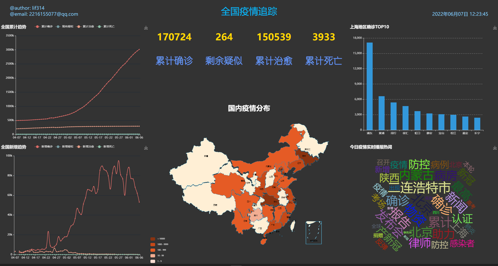
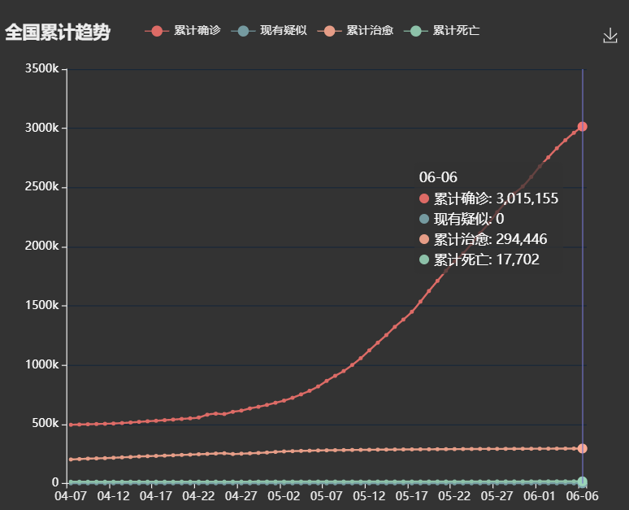
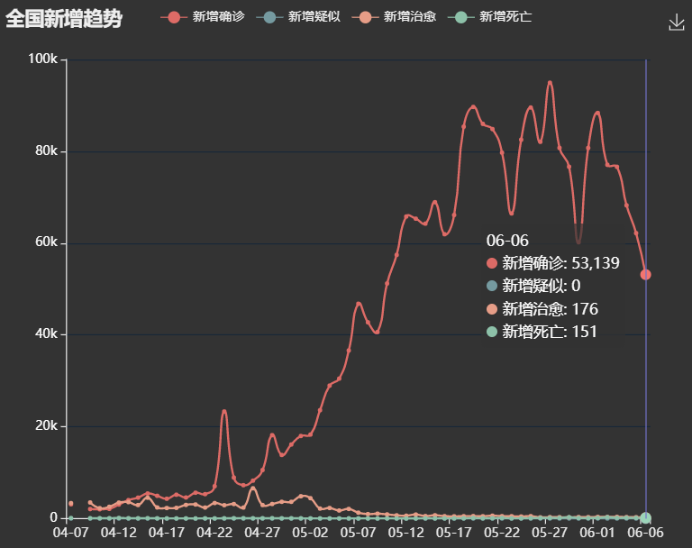
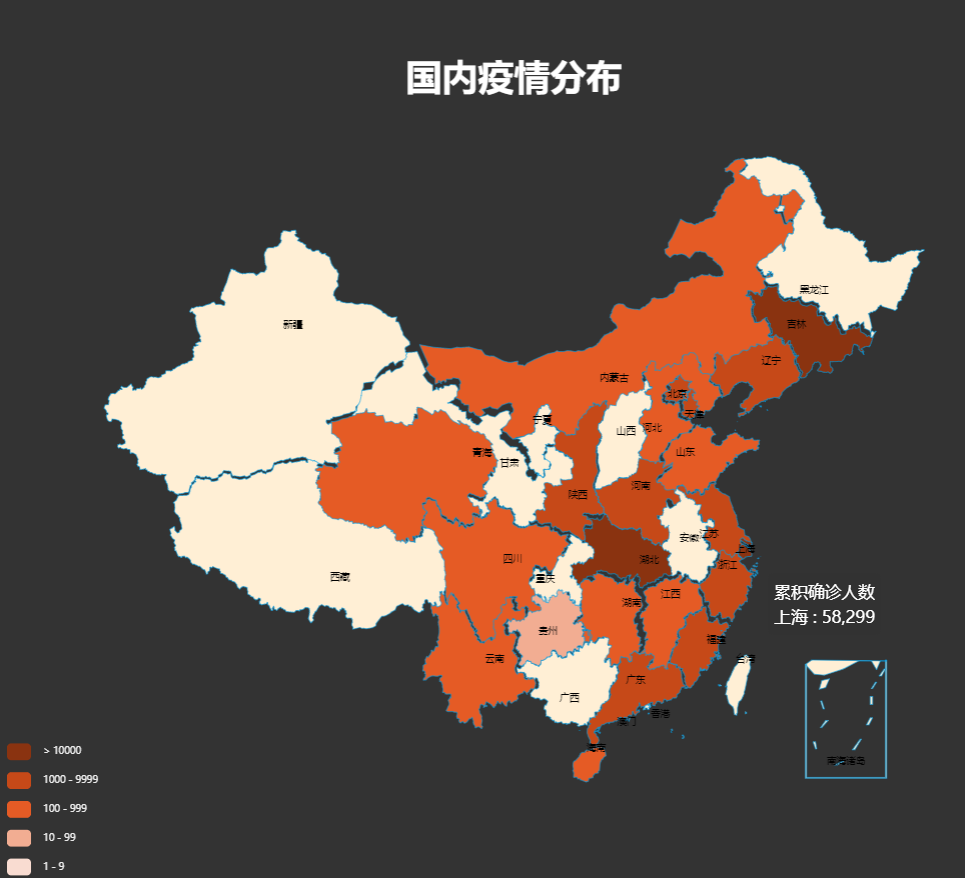
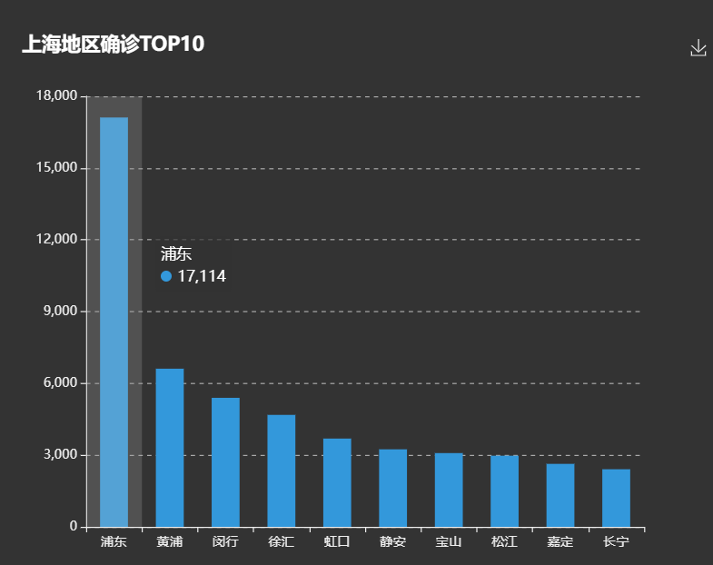

# Covid-19 Visualization

> @author 1951976 李林飞

## Introduction
Covid-19 Visualization is the third lab assignment in my Human Interaction Techniques course.

It is mainly to get the Chinese epidemic data by crawling technique, draw statistical graphs using Echarts. And adding timed tasks to update the data in real time.



## Technologies
- Environment: Windows 11 + python 3.6 + Pycharm 2022
- Crawler: urllib3, requests, Selenium
- Plotting: h5, Echarts
- Web: Flask
- Scheduling: flask_apscheduler, Apscheduler
- Data Storage: MySQL 5.7

## Architecture


## How to run
- clone
```shell
git clone https://github.com/lif314/COVID-19-visualization.git
```

- Install
```shell
pip install -r requirements.txt 
```

- Configuration Database
    - Create database: run the covid.sql script in the `sql` directory
    - Connecting to the database: Change the configuration information in `db_service` under the `service` directory
  ```python
    def get_conn():
    # 建立连接
    conn = pymysql.connect(host="localhost", port=3306, user="root", password="123456", database="covid", charset="utf8")
    # c创建游标A
    cursor = conn.cursor()
    return conn, cursor
```
  
- Run
```shell
python app.py
```

## Demonstration
- National outbreak cumulative trend



- National trend of new outbreaks


- Important national outbreak data


- National distribution of epidemic provinces



- Regional distribution of the outbreak in Shanghai



- Today's epidemic real-time broadcast hot words


## Future Work
- Add epidemic prediction function
- Add more charts for epidemic information
- Optimize data warehouse storage

## Implementation
### 1. Crawler
- requests: Get Tencent epidemic data
```python
# 爬虫获取腾讯数据
def get_tencent_data():
    url = "https://view.inews.qq.com/g2/getOnsInfo?name=disease_other"
    headers = {
        "user-agent": "Mozilla/5.0 (Windows NT 10.0; Win64; x64) AppleWebKit/537.36 (KHTML, like Gecko) Chrome/80.0.3987.122 Safari/537.36"
    }

    r = requests.get(url, headers)

    res = json.loads(r.text)

    data_all = json.loads(res["data"])

    # 获取中国每天疫情数据
    history = {}
    for day in data_all["chinaDayList"]:
        ds = day['y'] + "." + day['date']
        tup = time.strptime(ds, "%Y.%m.%d")  # 匹配时间
        ds = time.strftime("%Y-%m-%d", tup)  # 改变时间格式
        confirm = day["confirm"]
        suspect = day["suspect"]
        heal = day["heal"]
        dead = day["dead"]
        history[ds] = {"confirm": confirm, "suspect": suspect, "heal": heal, "dead": dead}
    # 全国每日新增数据
    for i in data_all["chinaDayAddList"]:
        ds = i['y'] + "." + i['date']
        tup = time.strptime(ds, "%Y.%m.%d")  # 匹配时间
        ds = time.strftime("%Y-%m-%d", tup)  # 改变时间格式
        confirm = i["confirm"]
        suspect = i["suspect"]
        heal = i["heal"]
        dead = i["dead"]
        if ds in history.keys():
            history[ds].update({"confirm_add": confirm, "suspect_add": suspect, "heal_add": heal, "dead_add": dead})

    # 各省地区今天数据每日数据信息
    details = []
    for pro_infos in data_all['statisGradeCityDetail']:
        update_time = pro_infos['mtime']
        province = pro_infos["province"]
        city = pro_infos['city']
        confirm = pro_infos["confirm"]
        confirm_add = pro_infos["confirmAdd"]
        heal = pro_infos["heal"]
        dead = pro_infos["dead"]
        details.append([update_time, province, city, confirm, confirm_add, heal, dead])
    return history, details
```

- selenium: Get Baidu epidemic data
```python
# 获取百度实时播报数据
def get_baidu_Realtime_broadcast():
    # 为什么要执行两次才有数据？ 第一次就直接报错？
    option = ChromeOptions()
    option.add_argument('--headless')  # 隐藏浏览器
    option.add_argument('--no-sandbox')  # linux禁用沙盘

    chrome_path = r"../chromedriver/chromedriver.exe"
    url = "https://voice.baidu.com/act/newpneumonia/newpneumonia#tab1"

    browser = Chrome(executable_path=chrome_path, options=option)

    browser.get(url)

    # 展开全部按钮
    button = browser.find_element_by_css_selector('#ptab-1 > div.Virus_1-1-350_2SKAfr > div.Common_1-1-350_3lDRV2')
    button.click()  # 点击展开
    time.sleep(1)  # 等待1s
    c = browser.find_elements_by_xpath('//*[@id="ptab-1"]/div[3]/div/div[2]/a/div')
    realtime_list = []
    # 解析数据
    for i in c:
        realtime_list.append(i.text)
    return realtime_list
```

### Data Warehouse
```python
# 插入历史数据
def insert_history():
    cursor = None
    conn = None
    try:
        dic = get_tencent_data()[0]  # 0代表历史数据字典
        print(f"{time.asctime()}开始插入历史数据")
        conn, cursor = get_conn()
        sql = "insert into history values (%s,%s,%s,%s,%s,%s,%s,%s,%s)"
        for k, v in dic.items():
            cursor.execute(sql, [k, v.get("confirm"), v.get("confirm_add"), v.get("suspect"),
                                 v.get("suspect_add"), v.get("heal"), v.get("heal_add"),
                                 v.get("dead"), v.get("dead_add")])
        conn.commit()
        print(f"{time.asctime()}插入历史数据完毕")
    except:
        traceback.print_exc()
    finally:
        close_conn(conn, cursor)


# 更新历史数据
def update_history():
    cursor = None
    conn = None
    try:
        dic = get_tencent_data()[0]  # 0代表历史数据字典
        print(f"{time.asctime()}开始更新历史数据")
        conn, cursor = get_conn()
        sql = "insert into history values (%s,%s,%s,%s,%s,%s,%s,%s,%s)"
        sql_query = "select confirm from history where ds=%s"
        for k, v in dic.items():
            if not cursor.execute(sql_query, k):
                cursor.execute(sql, [k, v.get("confirm"), v.get("confirm_add"), v.get("suspect"),
                                     v.get("suspect_add"), v.get("heal"), v.get("heal_add"),
                                     v.get("dead"), v.get("dead_add")])
        conn.commit()
        print(f"{time.asctime()}历史数据更新完毕")
    except:
        traceback.print_exc()
    finally:
        close_conn(conn, cursor)
```

### Web: Flask
```python
# 全国疫情重要数据
@app.route("/center_top", methods=["GET"])
def get_center_top_data():
    data = db_service.get_center_top_data()
    return jsonify({"confirm": int(data[0]), "suspect": int(data[1]), "heal": int(data[2]), "dead": int(data[3])})


# 全国疫情地图数据
@app.route("/center_bottom", methods=["GET"])
def get_center_bottom_data():
    res = []
    data = db_service.get_center_bottom_data()
    for tup in data:
        res.append({"name": tup[0], "value": int(tup[1])})
    return jsonify({"map": res})
```

### Plotting: Echarts
```js
// 中国地图
var ec_center = echarts.init(document.getElementById("center-bottom"), "dark");
var mydata = []

var optionMap = {
    title: {
        text: '国内疫情分布',
        subtext: '',
        x: 'center',
        textStyle:{
        //文字颜色
        color:'white',
        //字体风格,'normal','italic','oblique'
        fontStyle:'normal',
        fontWeight:'bold',
        //字体系列
        fontFamily:'sans-serif',
        //字体大小
　　　　 fontSize:30}
    },
    tooltip: {
        trigger: 'item'
    },
    //左侧小导航图标
    visualMap: {
        show: true,
        x: 'left',
        y: 'bottom',
        textStyle: {
            fontSize: 8
        },
        splitList: [{
            start: 1,
            end: 9
        },
            {
                start: 10,
                end: 99
            },
            {
                start: 100,
                end: 999
            },
            {
                start: 1000,
                end: 9999
            },
            {
                start: 10000
            }
        ],
        color: ['#8A3310', '#C64918', '#E55B25', '#F2AD92', '#F9DCD1']
    },

    //配置属性
    series: [{
        name: '累积确诊人数',
        type: 'map',
        mapType: 'china',
        roam: false,
        itemStyle: {
            normal: {
                borderWidth: .5,
                borderColor: '#009fe8',
                areaColor: '#ffefd5'
            },
            emphasis: {
                borderWidth: .5,
                borderColor: '#4b0082',
                areaColor: '#fff'
            }
        },
        label: {
            normal: {
                show: true, //省份名称
                fontSize: 8
            },
            emphasis: {
                show: true,
                fontSize: 8
            }
        },
        data: mydata //数据
    }]
};

//使用制定的配置项和数据显示图表
ec_center.setOption(optionMap);

// 获取全国数据
function get_center_bottom() {
    $.ajax({
        url: "/center_bottom",
        success: function (data) {
            // console.log("data:", data )
            optionMap.series[0].data = data.map;
            ec_center.setOption(optionMap);
        },
        error: function (xhr, type, errorThrown) {
            console.log("获取时间失败：", errorThrown)
        }
    })
}

//  定时更新
setInterval(get_center_bottom, 1000 * 100)
```

### Scheduling
```python
class Config(object):
    SCHEDULER_API_ENABLED = True

scheduler = APScheduler()

# @scheduler.task('interval', id='do_job_1', seconds=30, misfire_grace_time=900) # 测试
@scheduler.task('cron', id='do_job_1', hour=10, misfire_grace_time=900) # 每天10点更新
def job_update_history():
    print("更新历史数据")
    realtime_service.update_history()


# @scheduler.task('interval', id='do_job_2', seconds=30, misfire_grace_time=900) # 测试
@scheduler.task('cron', id='do_job_2', hour=10, misfire_grace_time=900) # 每天10点更新
def job_update_details():
    print("更新详细数据")
    realtime_service.update_details()

if __name__ == '__main__':
    scheduler.init_app(app)
    scheduler.start()
    app.run(host="127.0.0.1", port=5000, debug=True)
```